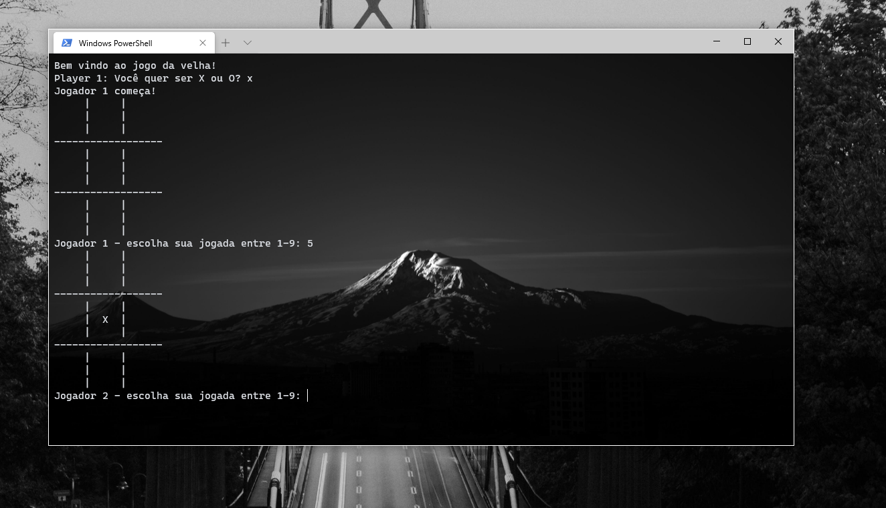

<h1 align="center">

# Jogo da Velha :x: / :o:
Projeto do clássico Jogo da Velha desenvolvido em Python. No momento o jogo não tem um **IA** desenvolvida é apenas o **Player 1** jogando contra o **Player 2**.

### :camera: Imagem do projeto
  

**Quer ajudar a melhorar o projeto? Envie uma pull request com sua contribuição** :wink:  

**Desenvolvedor:** Everton Oliver